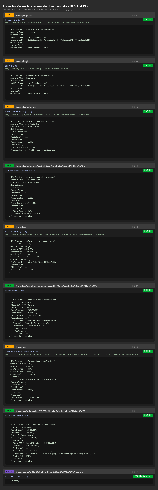

# Guía de pruebas en Postman — CanchaYa

Backend en `http://localhost:8080`. Arranca con `mvn spring-boot:run` (necesita la URI de MongoDB en `config/application.properties` o la variable `MONGODB_URI`).

> **IMPORTANTE — cómo enviar los datos.** Los endpoints reciben **parámetros** (`@RequestParam`), **no** un JSON en el cuerpo. En Postman:
> - **POST** → pestaña **Body** → selecciona **`x-www-form-urlencoded`** y agrega los pares `Key`/`Value` de cada tabla.
> - **GET / PATCH** → pestaña **Params** (o escribe los parámetros directo en la URL, ej. `?clienteId=...`). El Body queda en **none**.
>
> No uses `raw → JSON`: los parámetros no se enlazarían y la petición fallaría.

Las pruebas van **en cadena**: copia el `id` que devuelve una respuesta y pégalo en la siguiente (lo verás indicado como `{clienteId}`, `{establecimientoId}`, `{canchaId}`, `{reservaId}`).

---

## Prueba 1: Registrar un Cliente

| Campo | Valor |
|---|---|
| **Método** | `POST` |
| **URL** | `http://localhost:8080/auth/registro` |
| **Body** | `x-www-form-urlencoded` |

**Parámetros (Body → x-www-form-urlencoded):**

| Key | Value | Requerido |
|---|---|---|
| `nombre` | `Juan Cliente` | ✅ |
| `email` | `juan.cliente@canchaya.com` | ✅ |
| `password` | `secreta123` | ✅ |
| `telefono` | `3001234567` | ❌ opcional |

**Respuesta esperada — `200 OK`:**

```json
{
  "id": "77476d2b-b246-4a3d-bfb3-0f86ed93c7fd",
  "nombre": "Juan Cliente",
  "telefono": "3001234567",
  "email": "juan.cliente@canchaya.com",
  "passwordHash": "$2a$10$3Ic...",
  "rol": "CLIENTE",
  "reservas": [],
  "resumenPerfil": "Juan Cliente - 3001234567"
}
```

> Copia este `id` → es tu `{clienteId}`.

---

## Prueba 2: Login

| Campo | Valor |
|---|---|
| **Método** | `POST` |
| **URL** | `http://localhost:8080/auth/login` |
| **Body** | `x-www-form-urlencoded` |

**Parámetros:**

| Key | Value |
|---|---|
| `email` | `juan.cliente@canchaya.com` |
| `password` | `secreta123` |

**Respuesta esperada — `200 OK`:** el mismo usuario de la Prueba 1.
Con contraseña incorrecta devuelve **`401 Unauthorized`** (`Credenciales invalidas`).

---

## Prueba 3: Crear un Establecimiento

| Campo | Valor |
|---|---|
| **Método** | `POST` |
| **URL** | `http://localhost:8080/establecimientos` |
| **Body** | `x-www-form-urlencoded` |

**Parámetros:**

| Key | Value |
|---|---|
| `nombre` | `Complejo Pasto Centro` |
| `direccion` | `Calle 18 #25-40` |
| `adminId` | `admin-001` |

**Respuesta esperada — `200 OK`:**

```json
{
  "id": "ee4bf234-a0ca-4d6a-98aa-d521bca3a62a",
  "nombre": "Complejo Pasto Centro",
  "direccion": "Calle 18 #25-40",
  "administrador": { "id": "admin-001", ... }
}
```

> Copia este `id` → es tu `{establecimientoId}`.

---

## Prueba 4: Consultar un Establecimiento

| Campo | Valor |
|---|---|
| **Método** | `GET` |
| **URL** | `http://localhost:8080/establecimientos/{establecimientoId}` |
| **Body** | none |

Reemplaza `{establecimientoId}` por el id de la Prueba 3.

**Respuesta esperada — `200 OK`:** el establecimiento creado.
Si el id no existe devuelve **`404 Not Found`** (`Establecimiento no encontrado`).

---

## Prueba 5: Agregar una Cancha

| Campo | Valor |
|---|---|
| **Método** | `POST` |
| **URL** | `http://localhost:8080/canchas` |
| **Body** | `x-www-form-urlencoded` |

**Parámetros:**

| Key | Value |
|---|---|
| `nombre` | `Cancha 1` |
| `deporte` | `FUTBOL_5` |
| `establecimientoId` | `{establecimientoId}` |

> `deporte` debe ser uno de: `FUTBOL_11`, `FUTBOL_5`, `VOLEYBALL`, `BALONCESTO`.

**Respuesta esperada — `200 OK`:**

```json
{
  "id": "57f84432-90f4-489e-959d-74a33835189f",
  "nombre": "Cancha 1",
  "deporte": "FUTBOL_5",
  "estado": "DISPONIBLE",
  "horaApertura": "08:00:00",
  "horaCierre": "22:00:00",
  "duracionAlquilerMinutos": 60,
  "establecimiento": { "id": "ee4bf234-...", ... }
}
```

> El horario (`08:00`–`22:00`) y la duración (`60` min) se asignan por defecto.
> Copia este `id` → es tu `{canchaId}`.

---

## Prueba 6: Listar Canchas de un Establecimiento

| Campo | Valor |
|---|---|
| **Método** | `GET` |
| **URL** | `http://localhost:8080/canchas?establecimientoId={establecimientoId}` |
| **Body** | none |

(En Postman, pestaña **Params**: Key `establecimientoId`, Value el id.)

**Respuesta esperada — `200 OK`:** un arreglo `[ ... ]` con las canchas del establecimiento.

---

## Prueba 7: Crear una Reserva (instantánea)

| Campo | Valor |
|---|---|
| **Método** | `POST` |
| **URL** | `http://localhost:8080/reservas` |
| **Body** | `x-www-form-urlencoded` |

**Parámetros:**

| Key | Value |
|---|---|
| `clienteId` | `{clienteId}` |
| `canchaId` | `{canchaId}` |
| `fecha` | `2026-06-10` |
| `horaInicio` | `10:00` |

> `fecha` en formato `AAAA-MM-DD`. `horaInicio` en formato `HH:mm` dentro del horario de la cancha (08:00–22:00).

**Respuesta esperada — `200 OK`:**

```json
{
  "id": "e0d52c37-2afb-411a-b088-e834f798f953",
  "fecha": "2026-06-10",
  "horaInicio": "10:00:00",
  "horaFin": "11:00:00",
  "estado": "CONFIRMADA",
  "metodoPago": "EFECTIVO",
  "cliente": { "id": "..." },
  "cancha": { "id": "..." }
}
```

> `horaFin` se calcula sola (`horaInicio` + 60 min). La reserva nace `CONFIRMADA`.
> Si repites la misma cancha/fecha/hora devuelve **`409 Conflict`** (`La franja ya esta reservada`).
> Copia este `id` → es tu `{reservaId}`.

---

## Prueba 8: Historial de Reservas del Cliente

| Campo | Valor |
|---|---|
| **Método** | `GET` |
| **URL** | `http://localhost:8080/reservas?clienteId={clienteId}` |
| **Body** | none |

**Respuesta esperada — `200 OK`:** arreglo `[ ... ]` con las reservas del cliente (confirmadas y canceladas).

---

## Prueba 9: Cancelar una Reserva

| Campo | Valor |
|---|---|
| **Método** | `PATCH` |
| **URL** | `http://localhost:8080/reservas/{reservaId}/cancelar` |
| **Body** | none |

Reemplaza `{reservaId}` por el id de la Prueba 7.

**Respuesta esperada — `204 No Content`** (sin cuerpo). La reserva queda en estado `CANCELADA_USUARIO` (verificable repitiendo la Prueba 8).

---

## Tabla resumen

| # | Método | URL | Body | Respuesta |
|---|---|---|---|---|
| 1 | `POST` | `/auth/registro` | x-www-form-urlencoded | `200 OK` |
| 2 | `POST` | `/auth/login` | x-www-form-urlencoded | `200 OK` / `401` |
| 3 | `POST` | `/establecimientos` | x-www-form-urlencoded | `200 OK` |
| 4 | `GET` | `/establecimientos/{id}` | none | `200 OK` / `404` |
| 5 | `POST` | `/canchas` | x-www-form-urlencoded | `200 OK` |
| 6 | `GET` | `/canchas?establecimientoId=` | none | `200 OK` |
| 7 | `POST` | `/reservas` | x-www-form-urlencoded | `200 OK` / `409` |
| 8 | `GET` | `/reservas?clienteId=` | none | `200 OK` |
| 9 | `PATCH` | `/reservas/{id}/cancelar` | none | `204 No Content` |


